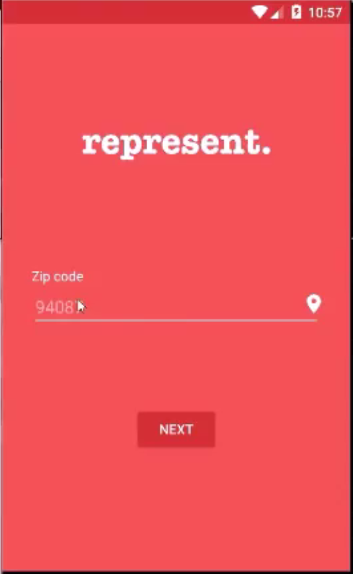
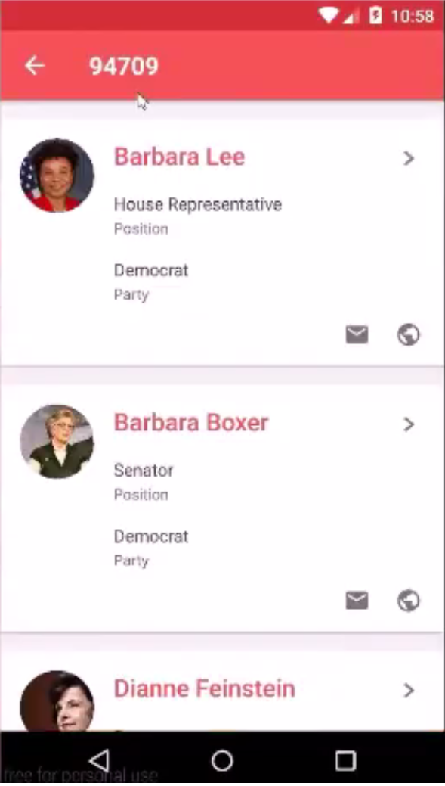
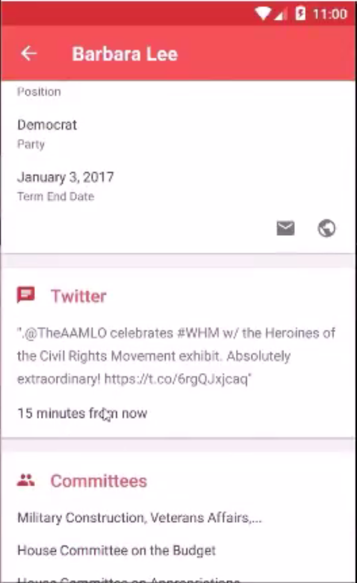
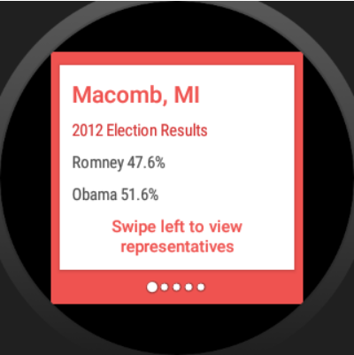
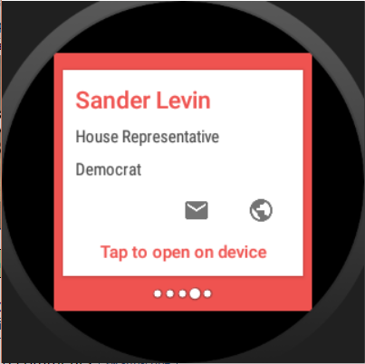

# PROG 02: Represent!

This app allows users to look up information on representatives of their area (or someone else's) based on a zipcode. Users can see their representatives' latest tweets, what committees they are on, and what recent bills they have sponsored, in addition to general information like the representative's party affiliation, title/posiont, and term end date. It also has a watch companion app with an extra feature of shaking the watch to take the user to the representatives of a random area.

## Authors

Sunjay Koshy ([koshy1@berkeley.edu](mailto:koshy1@berkeley.edu))

## Demo Video

See [CS160 PROG-2C DEMO] (https://www.youtube.com/watch?v=8Z_ptf5Qn8E)

## Screenshots
Phone Home Screen

Phone Main View

Phone Detailed View

Watch Home Screen

Watch 2012 Vote View

Watch Profile Card

## Acknowledgments

* I used code from the Geocoder API Dev Docs
* Consulted with a Berkely alumni on stylistic choices.
